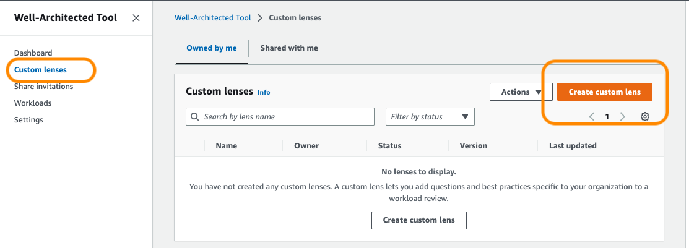
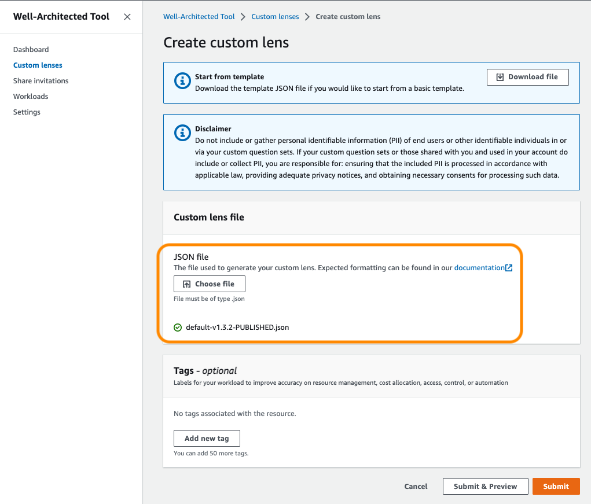
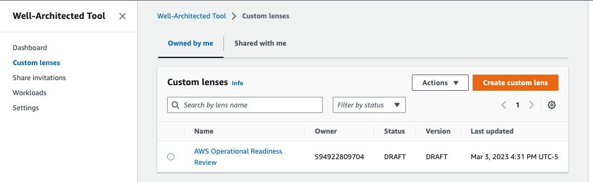
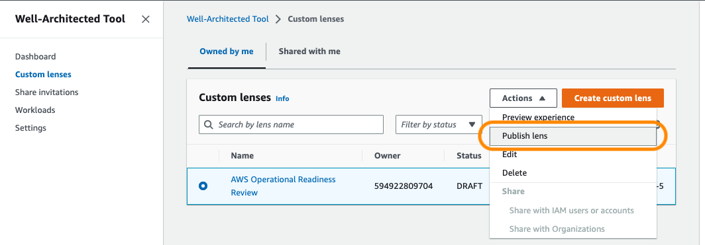
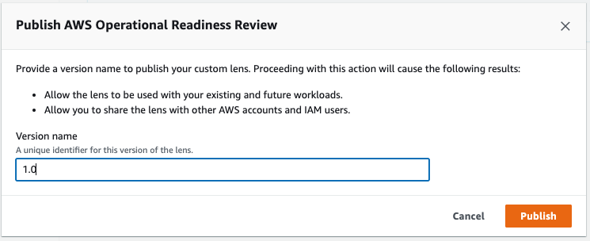
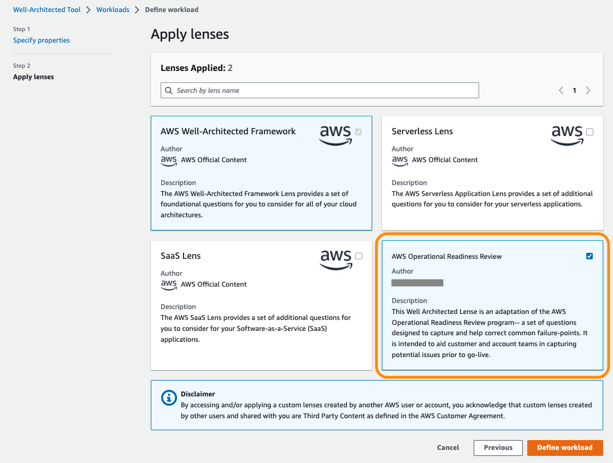

# AWS Operational Readiness Review (ORR)

## Introduction
|   |   |
|-----|---------------|
|  | The __AWS Operational Readiness Review (ORR)__ acts as a sanity & safety check for a new workload built on AWS services, assessed before the new workload goes live in production.  The ORR is complementary to the [Well Architected Framework Review (WAFR)](https://aws.amazon.com/architecture/well-architected), and provides additional readiness checks to assist a team preparing to support a new AWS workload or service. |

---

## Use

The ORR is designed as a [custom lens for the AWS Well Architected Tool](https://docs.aws.amazon.com/wellarchitected/latest/userguide/lenses-custom.html).  

The [AWS Well Architected Tool](https://docs.aws.amazon.com/wellarchitected/latest/userguide/intro.html) is a service in the cloud that provides a consistent process for 
measuring your architecture using AWS best practices. AWS WAFR Tool helps you throughout the product lifecycle by assisting with documenting the decisions that you make, 
providing recommendations for improving your workload based on best practices, and guiding you in making your workloads more reliable, secure, efficient, and cost-effective.

To add the ORR as a [custom lens for the AWS Well Architected Tool](https://docs.aws.amazon.com/wellarchitected/latest/userguide/lenses-custom.html), follow the steps 
under ["New Installation"](#new-installation), below.  

---

## New Installation

1. Check the `wafr-operational-readiness-lens` directory for a file named "orr-(version)-PUBLISHED.json", and select the highest version available. File names appended with the PUBLISHED tag have been tested by the repository maintainer to pass all validation checks that the Well Architected Tool service console performs at time of import. Any files in the `wafr-operational-readiness-lens` directory without "PUBLISHED" in the name are a work-in-progress version that may not import correctly without making some minor adjustments.

2. Once you've identified the file, pass that file to the Well Architected console by going to https://us-east-1.console.aws.amazon.com/wellarchitected/ (or your preferred region's equivalent) and then going to the Custom Lens page.  Select "Create Custom Lens".

3. Click the "Choose File" button to navigate to the `orr-(VERSION)-PUBLISHED.json` file that you identified earlier. Click "Submit".

> If you get any error messages at the top of the screen when you import the file, kindly reach out to the repository maintainer or make the appropriate modifications yourself to the file. If you definitely imported the file with "PUBLISHED" in its name and are still getting an error message, check the error message carefully. You cannot have two custom lenses with the same unique identifier, and the error message will say as such. See below for upgrade instructions. 

> If you get an error message about questions not passing validation, and you are definitely using a 'PUBLISHED' lens, then please reach out to the repository maintainer for assistance.

4. Once the lens has been imported, it should have a status of "DRAFT".

5. Click the "Actions" -> "Publish lens" option.  

6. Give the custom lens a version name. Its easiest to copy the version number from the file name, such as v1.3.2, but any version will do since you are only importing for use in your own account.  Click Publish.

---

## Upgrading an existing lens

Once you've imported a lens, you may want to check periodically for updates. 
You can check the `wafr-operational-readiness-lens` directory of the repository to see if there's a new major version available (as of writing, the current version is 1.3.2). 
If there is, download the file and go back to the Well Architected Console. Go to Custom Lenses and select the `AWS Internal Operational Readiness Review` custom lens item. 
Click "Edit" and then click "Choose File" and navigate to the new lens version you are interested in. If everything goes well, you'll get a green "Imported successfully" message, 
and then click "Publish lens." 

Give the new lens version a version name and publish it. 

The next time you go to the Workloads tab, you'll be prompted to upgrade any workload review that was using the old version of the lens. As part of the ugprade process, 
you'll be asked to save the current state of the review as a "milestone" so that you can go back and reference it at any time. 

---

## Using the ORR part of a workload review

This custom ORR lens is designed to be conducted after the Well Architected Review but weeks prior to the workload going live in production. 

While the Well Architected Lens is very prescriptive with an explicit list of items to be checked off, the ORR is more free-form and designed to be used as a discussion guide. 
The ORR purpose is to begin a discussion on higher-risk topics. 

Typical time for a review is 3-4 hours for a full review. Each question ends with a "(H)", "(M)", or "(L)", which maps to "High", "Medium", and "Low" respectively. If you have limited 
time for the review, you can defer the Low or Medium questions and focus more on the High/Medium questions. 

The questions specified are meant to begin a conversation. Ask yourself follow up questions, such as "Why?", "What happens if _____ does occur?", 
"Is this documented? Has it been tested?", to uncover further details and identify whether an item truly poses a risk to the business.  
Talk through scenarios, how they can occur, and what mechanisms are (or are not) in place to address them.

---

## Beginning a new review

Once the ORR is installed as a new custom lens from the prior steps, it can be used in a workload evaluation.

Go to the "Workloads" tab of the [Well-Architected Tool](https://console.aws.amazon.com/wellarchitected) Console and click "Define workload".  
Fill out the name, description, review owner, and other prompted fields from the console. When done, click "Next". 

You must have the "AWS Well-Architected Framework" as a selected lens, but you can also check off the "AWS Operational Readiness Review" to add it to the question list. 
Then click "Define Workload" and then the "Start Reviewing" dropdown menu on the next page. From the dropdown menu you can start with either a Well Architected Framework review or the 
Operational Readiness Review.

The questionnaire is broken into three main pillars-- Architecture, Release Quality & Procedures, and Incident & Event Management. The first pillar focuses on general architecture 
questions of the application itself, as well as topics such as forecasting for the event, testing beign done, and known failure modes, and other related topics. The second pillar 
focuses on how updates are deployed to the application before, during, and after the event. The third pillar focuses on items such as monitoring alarms, success/failure criteria, 
and oncall prcoedures.

Each question has side-bar "Helpful Text" to help expand upon the question's choices. Additionally, as mentioned above, each question has an (H), (M), (L) at the end to denote whether 
its considered a High/Medium/Low risk question. If you are short on time for the review, focusing on the high's can be an effective way to cut down the length. 

Again, this lens is meant to guide a discussion in order to uncover potential risks prior to go-live date for the application and spur discussion on ways to 
mitigate those risks within the confines of the application. While there are some "Suggested Improvements" for each question choice when you generate the report, they should be taken 
as advisory for your application.  The decision to implement any given recommendation should take additional factors into consideration, such the available funding, the architecture 
of the application, the risk to the business, and how much time is left to make such changes. 

---

## Feedback, Suggestions, and Support

If you run into issues, please double check the official [Well Architected Tool documentation](https://docs.aws.amazon.com/wellarchitected/latest/userguide/intro.html) for updated guidance on importing a new custom lens, upgrading a custom lens, or beginning a review.

If you have any feedback about the lens, suggestions for new questions, or further ideas on remediation text, please raise it as a [Gitlab Issue](https://github.com/awslabs/operational-readiness-review-custom-war-lens/issues).

If you would like to help improve this lens, please see the README & Contributing file at the root level of the repository. 

