# Operational Readiness Review (ORR) lens for the AWS Well-Architected Tool

An Operational Readiness Review (ORR) is a structured check, run before a workload goes live and again on a
recurring schedule, that turns lessons from past incidents into questions about how the workload is built,
released and operated. This repository publishes ORR custom lenses for the
[AWS Well-Architected Tool](https://docs.aws.amazon.com/wellarchitected/latest/userguide/) (WA Tool), informed by
the [AWS Operational Readiness Reviews whitepaper](https://docs.aws.amazon.com/wellarchitected/latest/operational-readiness-reviews/wa-operational-readiness-reviews.html)
and Well-Architected best practice
[OPS07-BP02 Ensure a consistent review of operational readiness](https://docs.aws.amazon.com/wellarchitected/latest/framework/ops_ready_to_support_const_orr.html).

The lenses are customer-run. They add no software to your accounts: you import a JSON file as a
[custom lens](https://docs.aws.amazon.com/wellarchitected/latest/userguide/lenses-custom.html) and use the WA Tool's
own improvement plans, milestones, reports and sharing.

Contents:
- [The lens family](#the-lens-family)
- [Quick start](#quick-start)
- [Running an ORR](#running-an-orr)
- [How 2.0.0 scores](#how-200-scores)
- [Known scoring limitations of v1.3.x](#known-scoring-limitations-of-v13x)
- [AWS GovCloud (US)](#aws-govcloud-us)
- [Data handling](#data-handling)
- [How this lens relates to other ORR material and AWS offerings](#how-this-lens-relates-to-other-orr-material-and-aws-offerings)
- [Repository layout](#repository-layout)
- [Contributing and security](#contributing-and-security)
- [Disclaimer](#disclaimer)
- [FAQ](docs/faq.md) and the other pages under [`docs/`](#repository-layout)

---

## The lens family

| Lens | Version | Contents | Attach it when | Release file |
|---|---|---|---|---|
| **AWS Operational Readiness Review** (the core ORR lens; it keeps its published name) | 2.0.0 | 36 questions and 134 scored statements in 4 pillars: 01 - Architecture, 02 - Release Quality, 03 - Event Management, 04 - Readiness Decision. A 15-question core path for triage and recurring check-ins | Every production workload, before launch and at least yearly | `orr-core.json` |
| **ORR - Mission-Critical Event Readiness** | 1.0.0 | 8 questions and 26 scored statements in 3 pillars: 01 - Prepare, 02 - Operate, 03 - After the event | Before a planned peak, alongside a current core review | `orr-event.json` |
| **ORR - Generative AI and Agents** | 1.0.0 | 9 questions and 25 scored statements in 3 pillars: 01 - Models, capacity and dependencies, 02 - Change safety and evaluation, 03 - Operations and safeguards | Workloads that call foundation models or run AI agents, alongside the core review | `orr-genai.json` |

Each lens keeps its own version number. The family deliberately stays small, because the WA Tool allows 15 custom
lenses per account per Region and that quota cannot be raised
([AWS Well-Architected Tool endpoints and quotas](https://docs.aws.amazon.com/general/latest/gr/wellarchitected.html));
the headroom is for your own lenses. A readable version of every question is in
[`docs/questions.md`](docs/questions.md).

A core lens review on a workload, with the four pillars and their question counts:


The event companion is for planned peaks such as elections, enrollment or tax deadlines, product launches, ticket
sales, broadcasts, and migrations or cutovers. It assumes the core answers are current and does not repeat them.
It is the self-assessment that comes before, or feeds, an
[AWS Countdown](https://aws.amazon.com/premiumsupport/aws-countdown/) engagement if you use one. Suggested timing:

| When | What |
|---|---|
| 3-6 months before | Budget and procure anything you must buy (for example a 1-year AWS Shield Advanced subscription, a support plan change, AWS Countdown Premium, or a load-test or DDoS-test partner). Request large quota increases |
| At least 8 weeks before | Complete the event review. If the event needs reserved Amazon EC2 capacity, AWS recommends requesting future-dated Capacity Reservations at least 56 days ahead; they apply to eligible instance families, need at least 32 vCPUs, can be requested 5 to 120 days ahead and carry a minimum commitment |
| 30-60 days before | Re-run the load test against this event's own forecast |
| 4 weeks before | Close every High risk, or record a formal acceptance. Items that can only be done in the final two weeks (escalation tree verification) need a dated plan and are re-scored at the 2-week checkpoint |
| 2-3 weeks before | If you use AWS Countdown Premium, sign up now: the [AWS Countdown](https://aws.amazon.com/premiumsupport/aws-countdown/) page says to begin 2-3 weeks before the event |
| 2 weeks before | Freeze changes or arm deployment blockers. Re-verify the escalation tree, edge rules and privileged access |
| Within 2 weeks after | Post-event review, scale-down, and a milestone |

The generative AI companion is for workloads that call a foundation model (managed, self-hosted or from a
third-party provider) or run an AI agent. It complements the AWS Well-Architected
[Generative AI lens](https://docs.aws.amazon.com/wellarchitected/latest/userguide/lens-catalog.html) and the Agentic
AI and Responsible AI lenses from
[aws-samples/sample-well-architected-custom-lens](https://github.com/aws-samples/sample-well-architected-custom-lens):
apply those as well, because this companion scores only launch-readiness and operational failure modes they do
not score. Examples are model end-of-life dates and inference routing, token quota arithmetic, incomplete model
output reported as success, fallback model parity, mutable prompt and guardrail versions, safeguards that fail
open, runaway token spend, and agent actions that bypass the enforcing control point. It does not score again what
the core lens already owns, such as timeouts and retries, phased rollout, alarms or on-call; where a statement
builds on a core practice, its helpful text says so. Its module owner is Leo Zhadanovsky (GitHub
`leozhad`), the repository maintainer named in [`CODEOWNERS`](CODEOWNERS).

A generative AI companion question in a workload review, with its helpful resources:


---

## Quick start

### Download

Lens files are published on [GitHub Releases](https://github.com/awslabs/operational-readiness-review-custom-war-lens/releases).
Each release attaches every lens file in pretty and minified form, a `manifest.json` (lens name, version, question
and statement counts, SHA-256 hash and source commit) and a `SHA256SUMS` file. Release tags and checksums replace
the `-PUBLISHED` file suffix used for v1 files.

Stable links that always return the newest release:

- Core lens: https://github.com/awslabs/operational-readiness-review-custom-war-lens/releases/latest/download/orr-core.json
  (minified: `orr-core.min.json`)
- Event companion: https://github.com/awslabs/operational-readiness-review-custom-war-lens/releases/latest/download/orr-event.json
  (minified: `orr-event.min.json`)
- Generative AI companion: https://github.com/awslabs/operational-readiness-review-custom-war-lens/releases/latest/download/orr-genai.json
  (minified: `orr-genai.min.json`)

Versioned names, such as `orr-core-2.0.0.json`, stay pinned to their release. Each release's files are also copied
into [`wafr-operational-readiness-lens/`](wafr-operational-readiness-lens/README.md), where the v1.3.2 to v1.3.6 files
remain unchanged.

If you cannot use the release page, the same files are in
[`wafr-operational-readiness-lens/`](wafr-operational-readiness-lens/README.md) (`orr-core-2.0.0.json`,
`orr-event-1.0.0.json`, `orr-genai-1.0.0.json`) with their checksums in [`dist/SHA256SUMS`](dist/SHA256SUMS).

Verify a download before you import it:

```bash
sha256sum --ignore-missing -c SHA256SUMS        # Linux
shasum -a 256 --ignore-missing -c SHA256SUMS    # macOS
```

### First install

Use these steps only for a lens you have never imported into this account and Region. To move from v1.3.x to
2.0.0, see [Upgrade an existing ORR lens](#upgrade-an-existing-orr-lens) instead.

1. Download the JSON file for the lens, either from the release page, from its `releases/latest/download/` link,
   or from the in-repository copy, and verify the checksum (see [Download](#download)).
2. Sign in to the AWS Management Console, open the AWS Well-Architected Tool console, and in the left navigation
   pane choose **Custom lenses**.
3. Choose **Create custom lens**. In the **Custom lens file** card, choose **Choose file** ("File must be of type
   .json"), select the JSON file you downloaded, and choose **Submit**. **Submit & Preview** does the same and
   then shows you the lens as reviewers will see it. **Tags - optional** is yours to use or to leave empty.

   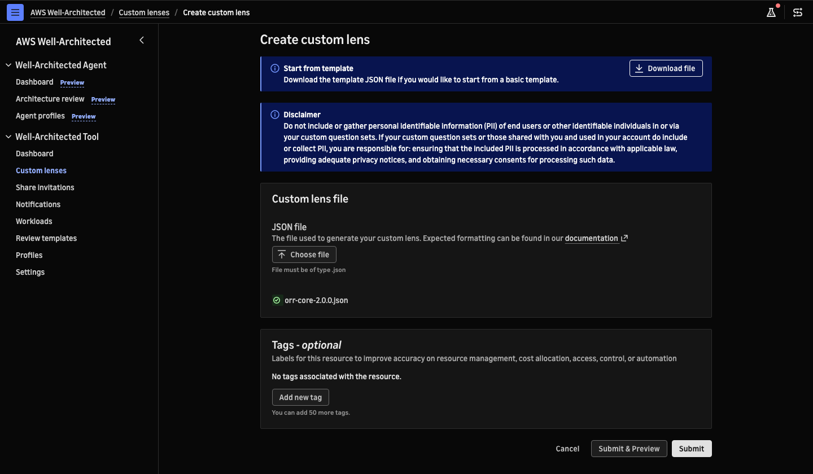

   The lens then appears in the **Custom lenses** list with status **DRAFT** and version **DRAFT**. A draft cannot
   be attached to a workload yet.

   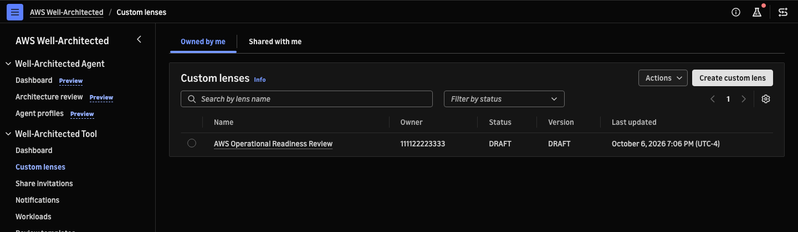

4. Select the lens, choose **Actions**, and choose **Publish lens**. (The lens page carries **Publish lens** too
   while the lens is a draft.)

   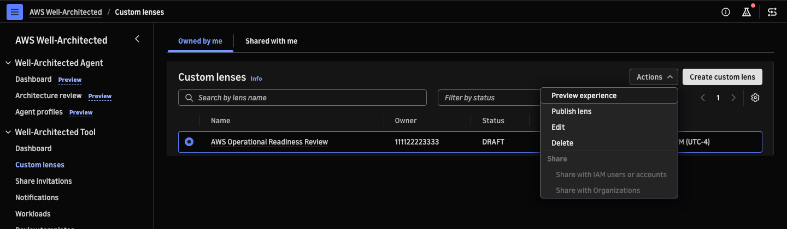

   A **Publish** dialog opens, titled with the lens name (**Publish AWS Operational Readiness Review** for the
   core lens). In **Version name**, enter the version from the release file name or from `manifest.json`, for
   example `2.0.0`, and choose **Publish** (the lens JSON itself has no version field; the WA Tool version is the
   name you type here). A first publish has no major or minor choice; that choice appears only when you publish an
   update.

   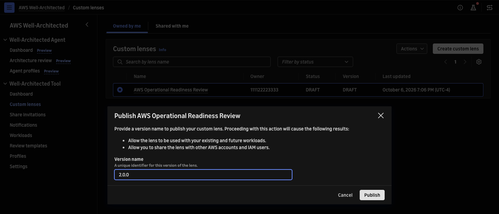

   The lens page then shows **Version** 2.0.0 and **Status** Published, with the lens ARN, the lens description,
   and a **Custom lens file** card that offers **Edit** and **Download json file**.

   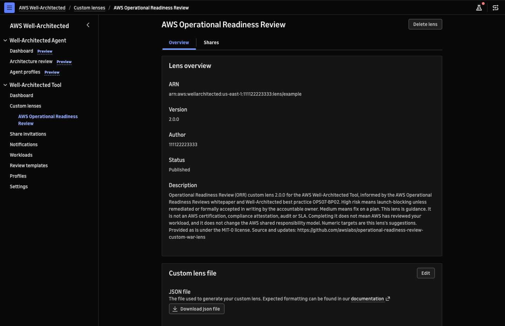

5. Attach the lens to a workload. To define a new workload, choose **Workloads**, then **Define workload**, and
   work through the three steps (**Specify properties**, **Apply profile**, **Apply lenses**). In **Apply lenses**,
   the lens appears as a card under **Custom lenses**, above the Lens Catalog; select it and choose **Define
   workload** ([Defining a workload](https://docs.aws.amazon.com/wellarchitected/latest/userguide/define-workload.html)).
   For a workload that already exists, open it and apply the lens to it. A workload can have up to 20 lenses.

   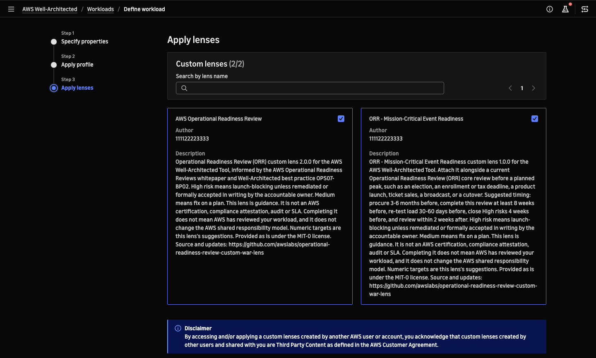

6. When you finish a review, choose **Save milestone** on the workload and name it, for example
   `ORR-2026-10-launch`
   ([Milestones](https://docs.aws.amazon.com/wellarchitected/latest/userguide/milestones.html)).

Details: [Creating a custom lens](https://docs.aws.amazon.com/wellarchitected/latest/userguide/lenses-create.html).
For 1.0.0 each companion is a first install, because it is a new lens, so repeat the steps above with
`orr-event.json` for the event companion and `orr-genai.json` for the generative AI companion. Later companion
versions are uploaded with **Edit** on your existing companion lens, like any upgrade (never **Create custom
lens**). With all three lenses installed and published, the **Custom lenses** list looks like this:

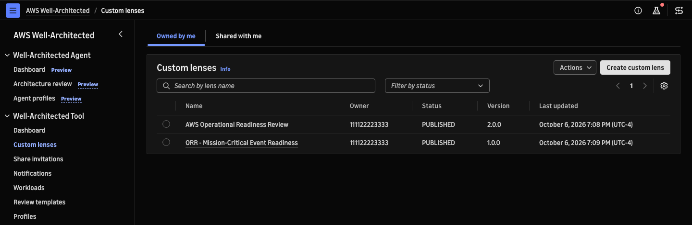

### Upgrade an existing ORR lens

[`MIGRATION.md`](MIGRATION.md) has the full procedure, the API steps and the question-by-question mapping from
v1.3.6.

1. If you modified the lens, for example in an ORR workshop, run `ExportLens` first and diff the export against
   v1.3.6. Uploading 2.0.0 replaces the lens content, so move your own questions into a separate add-on lens
   ([`docs/customizing.md`](docs/customizing.md)).
2. **Console:** choose **Custom lenses**, open your existing ORR lens, and in the **Custom lens file** card choose
   **Edit**. On the **Edit** page (**Continue from existing** offers **Download file** if you want a copy of the
   current content first), choose **Choose file**, select the new JSON file, and choose **Submit**. Editing a
   published lens puts it back into **DRAFT**, while workloads keep using the published version until you publish
   the new one.

   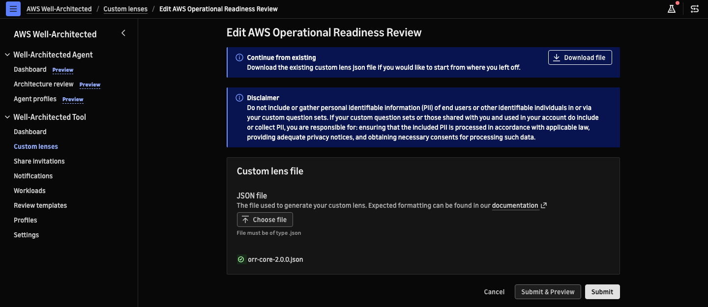

3. Then choose **Publish lens**. The publish page lists, per changed pillar, the **Updated questions**,
   **Removed questions** and **New questions** (each list is a small scrolling box). Under **Versioning**, for
   **Version change** choose **Major version** ("Will notify workloads using the lens"), enter `2.0.0` in
   **Version name**, and choose **Publish custom lens**
   ([Publishing an update to a custom lens](https://docs.aws.amazon.com/wellarchitected/latest/userguide/lenses-publish-update.html)).

   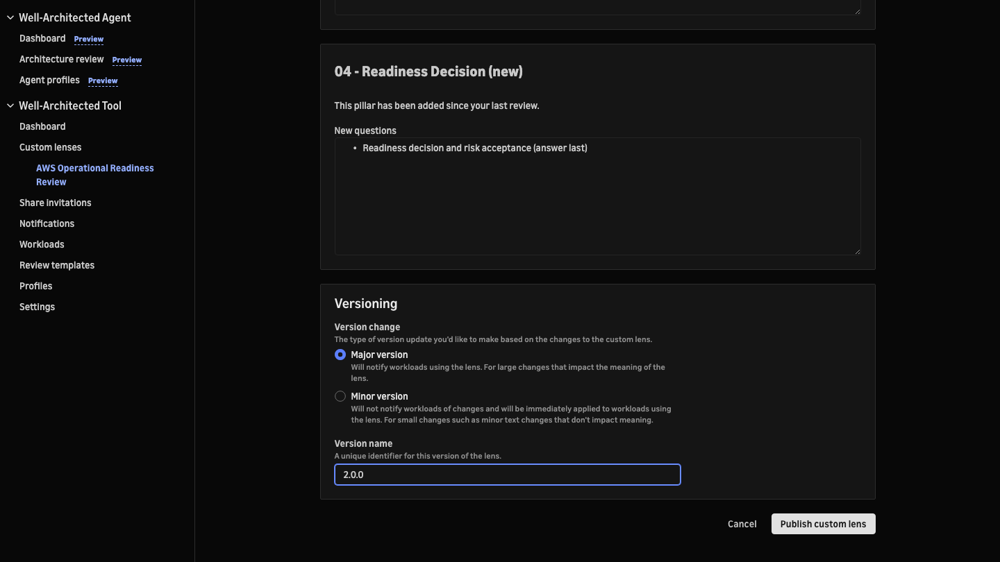

4. **API:** call `ImportLens` with `LensAlias` set to the existing lens ARN. Do not wait for an import status: in
   our sandbox test on 2026-10-06, `ImportLens` returned only the lens ARN. Instead, call `ListLenses` with
   `LensStatus=DRAFT` and `LensType=CUSTOM_SELF` until the lens appears with a newer update time, then call
   `CreateLensVersion` with `IsMajorVersion=true` and `LensVersion="2.0.0"`. Keep the lens name: the WA Tool
   rejects an upload whose name differs from the published lens name. If your published lens is not named exactly
   "AWS Operational Readiness Review" (a lens first imported from the v1.3.3 or v1.3.4 file is named
   "AWS Operational Readiness Review v1.3.3" or "... v1.3.4"), edit the `name` field of the 2.0.0 file to match
   your published name before you upload it ([`MIGRATION.md`](MIGRATION.md)).
5. **Never use Create custom lens to upgrade.** It creates a second lens with a new ARN, uses one of the 15
   custom-lens slots, and existing workloads get no upgrade notice; their answers and notes stay with the old lens.
6. Each workload owner then upgrades the workload's lens review. The workload page shows a **Lens version not
   current** banner with **View available upgrades**; in the workloads list the same workload is flagged
   "Supporting resource(s) not current".

   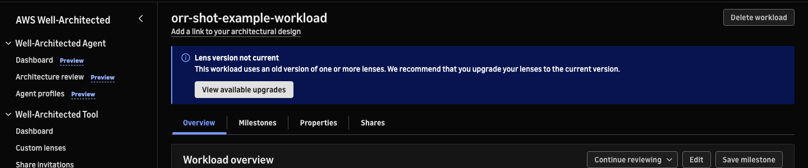

   Both open **Notifications**, where the row shows **Notification type** Not current, the **Version in use** and
   the **Current available version**. Select the row and choose **Upgrade lens version**
   ([Lens upgrades](https://docs.aws.amazon.com/wellarchitected/latest/userguide/lens-upgrades.html)).

   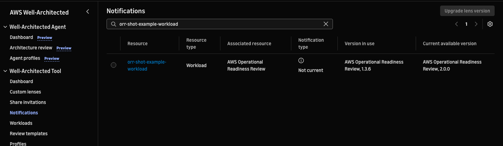

   The upgrade page ends in an **Acknowledgment** card: notes and still-valid selections are retained, and the
   current review is saved as a milestone. Enter a **Milestone name** (3 to 100 characters), for example
   `ORR-2026-10-pre-v2-upgrade`, select **I understand and accept these changes**, and choose **Save**. The WA Tool
   saves that milestone before it upgrades, and the upgrade cannot be undone.

   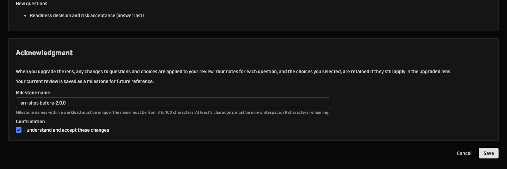

   The milestone name in that illustration comes from a test workload and does not follow the
   `ORR-<yyyy-mm>-<purpose>` convention this README recommends.

   Then re-answer every question: all 2.0.0 choice IDs are new, so v1.3.6 selections do not carry over. Notes and
   "does not apply" flags (with their reasons) on the 20 kept questions do carry over, so re-confirm each one
   ([`MIGRATION.md`](MIGRATION.md)). The **Acknowledgment** card states that your notes and the choices you
   selected are retained if they still apply in the upgraded lens; because every 2.0.0 choice ID is new, no
   selection still applies.

A major version notifies every workload that uses the lens; a minor version is applied silently. That is why 2.0.0
is published as a major version.

### Organizations

A central team imports each release into one account per Region and shares it with organizational units (OUs)
([Sharing a custom lens](https://docs.aws.amazon.com/wellarchitected/latest/userguide/lenses-sharing.html)). Share
invitations to accounts and users expire if they are not accepted within seven days. Lenses that are shared with
you cannot be applied to a review template
([Creating a review template](https://docs.aws.amazon.com/wellarchitected/latest/userguide/creating-a-review-template.html)),
so a team that needs templates imports its own copy. If you pre-fill templates, pre-fill only platform-provided
controls that come with evidence; never pre-fill load tests, Availability Zone tests or sign-off.

---

## Running an ORR

The ORR is a review with people, not a form. Each question opens a discussion: ask "why?", "what happens if this
fails?", "is it documented?" and "when was it last tested?", and ask to see the evidence. Every question
description starts with its maximum risk and category, and lists the evidence to collect and, where it applies,
when the question is out of scope. More detail is in [`docs/running-an-orr.md`](docs/running-an-orr.md) and
[`docs/facilitator-guide.md`](docs/facilitator-guide.md), and common questions are answered in
[`docs/faq.md`](docs/faq.md). Cadences and time boxes below are the maintainers' suggestions; adjust them to your
organization.

### When

| Use | Lenses | When | Suggested time box | Output |
|---|---|---|---|---|
| Pre-launch ORR | Core | Self-assessment at design-complete; a mid-cycle check-in on the release and testing questions; a facilitated review 2-4 weeks before launch. Answer `readiness_signoff` last | Core path: about 90-120 minutes (triage and check-ins only). Full core: about 3 hours in two 90-minute sessions, plus 2-4 hours of evidence gathering beforehand | Milestone `ORR-<yyyy-mm>-launch`, improvement plan, one-page readout, go or no-go record |
| Recurring ORR | Core | At least yearly, and after a major architecture change or a significant incident | About 2 hours: review what changed since the last milestone, then confirm the rest | Milestone `ORR-<yyyy-mm>-recurring` and the trend against the last milestone |
| Event readiness | Core plus event companion | See the timing table in [The lens family](#the-lens-family) | About 60 minutes for the event lens, on top of a current core review | Milestones before and after the event |
| Generative AI and agents | Core plus generative AI companion | With the pre-launch ORR, for workloads that call foundation models or run AI agents, and again at each recurring ORR | About 45 minutes for the generative AI lens, on top of the core review | The same milestone as the core review, for example `ORR-<yyyy-mm>-launch` |

### Roles

- **Accountable owner:** the business owner or, in government, the authorizing official. Decides and accepts
  risks. Acceptances are recorded in your risk register or plan of action and milestones (POA&M), not in WA Tool
  notes.
- **Facilitator:** independent of the workload team. In the whitepaper's terms this is the
  [Ops Champion](https://docs.aws.amazon.com/wellarchitected/latest/operational-readiness-reviews/iteration.html),
  who challenges the team on its answers during the review.
- **Workload team leads:** answer the questions and bring the evidence.
- **On-call representative.**
- **Security representative:** for `releases_security_readiness`, and for `gai_safeguards` and `gai_agent_bounds`
  when the generative AI companion is attached.

### Who answers

The team that runs the workload answers. That can be an in-house team, or an operations partner, such as a systems
integrator or managed service provider, that runs part of the workload under contract. A partner's leads answer for
the part they run, with evidence you can inspect. AWS account teams or partners may facilitate a review, but the
lens never assumes they will.

### Core path and full core

The core path is a published subset of 15 questions for triage and recurring check-ins. It covers every
launch-blocking failure class:

- irreversible data loss: `architecture_rpo_rto`, `architecture_data_corruption`;
- failures triggered from outside the team's control (certificate expiry, DDoS, overload, loss of an Availability
  Zone, a Region dependency or a private network path): `event_expiring_materials`, `architecture_edge_protection`,
  `architecture_defensive_throttling`, `architecture_load_testing`, `event_resilience_recoveries`,
  `architecture_recovery_dependencies`, `architecture_hybrid_connectivity`;
- change-induced failure: `releases_manual_changes`, `releases_staged_deployments`, `releases_deployment_rollback`;
- detection and response: `event_alarms`, `event_oncall_rotation`;
- the decision itself: `readiness_signoff`.

The WA Tool does not flag core-path questions in the console; the 15 IDs are listed above and in the **Core path**
row of each question in [`docs/questions.md`](docs/questions.md). Print or share that list before a triage session.

**A core-path session is preliminary.** A launch go or no-go requires the full core, with every question answered
or marked not applicable with a reason. `readiness_signoff` includes the statement "every question in this lens is
answered or marked not applicable with a reason", so a review that skips questions cannot score better than High
on the decision question.

### What a question looks like

Every question page carries the question description (maximum risk, category, evidence to collect and, where it
applies, when the question is out of scope), a **Question does not apply to this workload** toggle, the choices
under **Select from the following** with an **Info** link each, a **Notes - optional** box, and a **Helpful
resources** panel on the right that holds the "Good looks like" text, the platform and partition notes, and the
links for each choice. **Save and exit** saves the answer; the pillar and lens summary counters update when you
reload the page.

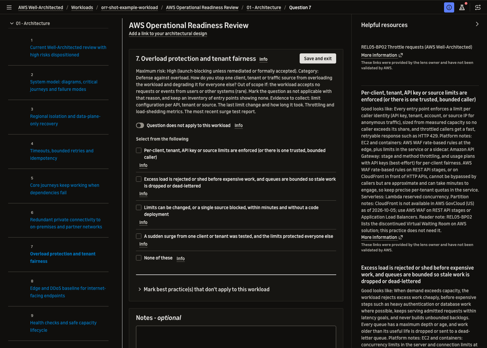

**Ticking "None of these" does not clear your other choices.** It greys out the other choices but does not clear
any you already ticked, and they are saved with it, so clear them yourself first; a saved answer that holds **None
of these** together with any other choice scores the question's maximum risk ([How 2.0.0 scores](#how-200-scores)).

To exclude part of a question, prefer the question's scope-exit statement where it has one. To exclude the whole
question, use the **Question does not apply to this workload** toggle and record the reason. Marking individual
best practices not applicable is not recommended: expand **Mark best practice(s) that don't apply to this
workload** and, per best practice, tick the box and set **Reason not applicable** (Out of Scope, Business
Priorities, Architecture Constraints or Other) and **Additional details**, both of which are optional in the
console. A statement marked not applicable counts as satisfied in an AND condition, so marking a core statement
not applicable can score the question Medium or No risk without the practice
([`docs/scoring.md`](docs/scoring.md#not-applicable)). **None of these** cannot be marked not applicable.

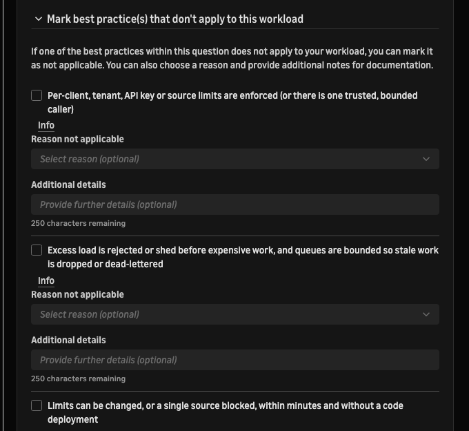

### What the risk levels mean

- **High:** launch-blocking unless remediated, or formally accepted in writing by the accountable owner with an
  expiry date.
- **Medium:** the core practice is in place but hardening is outstanding. Fix it on a plan; it does not block
  launch. The ORR whitepaper keeps ORRs High-only to stay lightweight; this lens keeps a Medium tier as a deliberate,
  documented deviation. Read reports High first.
- **No risk:** every listed practice is in place and the evidence lines are satisfied.

A statement that marks the question out of scope (for example "the workload has no internet-facing endpoints")
scores No risk, so the facilitator accepts it only with the evidence its helpful text lists.

### Readout, inspection and tracking

- **Readout.** A one-page summary of risks, mitigations, accepted risks with expiry dates, and the go or no-go
  decision, shared with the accountable owner and stakeholders.
- **Accepted risks.** Record each accepted High in the question notes only as
  `EXC:<register-id> exp:YYYY-MM-DD role:<approver-role>`, for example
  `EXC:RR-0142 exp:2027-03-31 role:authorizing-official`. Keep the approver's name, the reason and the compensating
  controls in your risk register or POA&M.
- **Inspect.** Report the date of the last ORR, open High items and expired acceptances per workload in your
  recurring operations review, as the whitepaper describes in
  [Inspect the process](https://docs.aws.amazon.com/wellarchitected/latest/operational-readiness-reviews/inspect-the-process.html).
- **Track.** Send improvement items to the
  [AWS Well-Architected Tool Connector for Jira](https://docs.aws.amazon.com/wellarchitected/latest/userguide/jira.html)
  (commercial Regions), to [AWS Systems Manager OpsCenter](https://docs.aws.amazon.com/systems-manager/latest/userguide/OpsCenter.html),
  or to your own tracker from a `ListLensReviewImprovements` export. For ORR-only risk counts per workload, use
  `GetLensReview`: the JSON consolidated report breaks counts down only for the AWS Well-Architected Framework
  lens, and its workload totals include every lens on the workload.

---

## How 2.0.0 scores

Authors never write risk rules by hand. Each statement is tagged as a scope exit, a core practice, one of a group
of alternatives, or a secondary practice, and the generator emits at most three rules per question from those tags.
Before every release, CI evaluates every combination of answers for every question and fails unless:

- High is reachable on every question whose maximum is High;
- selecting "None of these", alone or with any other choice, scores the question's maximum risk (neither the
  console nor the API makes "None of these" exclusive, so the rules also require that it is not selected);
- selecting every practice scores No risk;
- adding a practice never raises the risk;
- every statement changes the risk in at least one combination.

The tier rules, what Medium means, and every place where this lens rates a practice higher than the
Well-Architected Framework are in [`docs/scoring.md`](docs/scoring.md).

---

## Known scoring limitations of v1.3.x

For teams still reading v1.3.6 reports. These were found by evaluating every combination of answers in the
published `orr-v1.3.6-PUBLISHED.json`, and they are fixed in 2.0.0:

- High cannot be reached on 22 questions, 7 of them titled (H).
- Selecting only "None of these" scores just Medium on 23 questions, 8 of them titled (H).
- On `architecture_services_used`, also documenting third-party dependencies raises the risk to Medium.
- `releases_manual_changes` has no default rule.
- The `queueing` and `async_execution` choices are never used by any rule.

Treat v1.3.6 results as conversation notes rather than evidence, and re-answer in 2.0.0 ([`MIGRATION.md`](MIGRATION.md)).

---

## AWS GovCloud (US)

Status below was checked on 2026-10-06 against the
[AWS GovCloud (US) User Guide](https://docs.aws.amazon.com/govcloud-us/latest/UserGuide/govcloud-wellarchitected.html)
and AWS regional availability data. Check [AWS Capabilities by Region](https://builder.aws.com/build/capabilities)
for current status, and verify per Region.

- **Lens import and upgrade work the same way.** `ImportLens`, `CreateLensVersion` and `UpgradeLensReview` are
  available in AWS GovCloud (US-West) and AWS GovCloud (US-East). Import the lens into each Region where you run
  reviews; lenses and shares are per Region.
- **Not available in AWS GovCloud (US):** the WA Tool Connector for Jira and Profiles. Track improvement items with
  AWS Systems Manager OpsCenter, which is available, or export them with `ListLensReviewImprovements` into your
  own tracker.
- **AWS Shield Advanced and Amazon CloudFront are not available in AWS GovCloud (US).** The edge, DDoS and event
  questions accept a documented alternative edge and DDoS pattern, and a tabletop rehearsal of DDoS response.
- **AWS Well-Architected Agent (preview)** onboards workloads from AWS commercial Regions, and its architecture
  reviews support only the Well-Architected Framework lens, so it does not evaluate this custom lens.
- **Partition notes.** Statements that name a service with different availability in AWS GovCloud (US) carry a
  dated partition note and, where a core practice depends on such a service, a method-based alternative. See
  [`docs/govcloud.md`](docs/govcloud.md).
- **Generative AI and agents (checked 2026-10-07).** Amazon Bedrock is in both AWS GovCloud (US) Regions, with model
  availability that differs by Region. Amazon Bedrock AgentCore is in AWS GovCloud (US-West) only. Global
  cross-Region inference routes only to commercial Regions, so for routing within the partition use in-Region
  inference or the US-GOV geographic profile where a model offers it. The generative AI companion's partition notes
  and [`docs/govcloud.md`](docs/govcloud.md#generative-ai-and-agents) give the details.
- **Data that may leave the GovCloud (US) Regions.** AWS lists the AWS account IDs associated with a workload, the
  workload name, milestone names and the review owner. Keep export-controlled, sensitive and personal information
  out of those fields as well as out of notes.

---

## Data handling

- Lens files contain no customer data. Answers and notes stay in your account and Region.
- Notes appear in reports, and they sync to Jira when the connector is enabled. Do not paste secrets, credentials,
  personal data or sensitive incident details into notes; link to the evidence instead.
- An accepted risk carries only the `EXC:<register-id> exp:YYYY-MM-DD role:<approver-role>` tag in notes. The
  reason, the compensating controls and the approver's name stay in your risk register or POA&M.
- Milestone names follow `ORR-<yyyy-mm>-<purpose>` and should hold nothing sensitive.
- This repository collects no telemetry and stores no customer answers.

---

## How this lens relates to other ORR material and AWS offerings

- **AWS Operational Readiness Review Whitepaper Sample.** OPS07-BP02 links a "Sample Operational Readiness Review
  (ORR) Lens" in aws-samples:
  [`custom-lens-wa-hub/ORR-Lens`](https://github.com/aws-samples/custom-lens-wa-hub/tree/main/ORR-Lens), named "AWS
  Operational Readiness Review Whitepaper Sample" (16 questions; folder last changed 2023-04-20). The sample
  introduces ORRs from the whitepaper's example questions. This lens is the maintained, scored version: v1.3.4
  merged content from the sample, and 2.0.0 adds tested scoring, evidence lines and current guidance.
- **Well-Architected Framework Review (WAFR).** The Framework lens covers breadth across six pillars. The ORR covers
  launch-blocking operational risk in depth and is run separately. The `well_architected` question checks that a
  current Framework review exists and that its high-risk issues are dispositioned, so the two are not double
  counted.
- **Other lenses.** Attach the AWS lenses that fit the workload, for example from the
  [Lens Catalog](https://docs.aws.amazon.com/wellarchitected/latest/userguide/lens-catalog.html) (no import needed)
  or from [aws-samples/sample-well-architected-custom-lens](https://github.com/aws-samples/sample-well-architected-custom-lens)
  (each import uses one custom-lens slot).
- **AWS Generative AI, Agentic AI and Responsible AI lenses.** ORR - Generative AI and Agents complements these
  lenses and does not replace them. They cover how to design, secure, evaluate and govern generative AI and agent
  workloads; the companion scores only the launch-readiness and operational failure modes they do not score, and
  none of its statements restates one of their best practices.
- **Your own questions.** Keep this lens unmodified and put your organization's questions in a separate add-on lens
  attached to the same workload, so upgrades never touch your content
  ([`docs/customizing.md`](docs/customizing.md), starter file
  [`templates/org-addon-lens.json`](templates/org-addon-lens.json)).
- **AWS offerings.** These complement the lens and none is required: AWS Resilience Hub to validate recovery
  objectives; AWS Fault Injection Service and Amazon Application Recovery Controller for testing and Availability
  Zone evacuation; AWS Countdown for planned events; AWS Support plans for escalation; and the AWS
  Well-Architected Agent preview and AWS Trusted Advisor for automated Framework checks. Partition notes in the
  lens say where each is available.

---

## Repository layout

| Path | What it holds |
|---|---|
| `lens-src/` | The YAML source of truth, one file per question ([`lens-src/SCHEMA.md`](lens-src/SCHEMA.md)) |
| `tools/orrlens/` | The generator and every check (Python 3, standard library plus PyYAML) |
| `dist/` | CI-built lens files; never edited by hand |
| `wafr-operational-readiness-lens/` | The v1.3.2 to v1.3.6 files, unchanged, plus a copy of each released file |
| `docs/` | Running an ORR, facilitator guide, FAQ, scoring, customizing, GovCloud notes, recurring operations review agenda, related AWS Post-Event Summaries, sandbox gate results, decisions, readable questions |
| `MIGRATION.md`, `CHANGELOG.md` | Upgrade guide from v1.3.x and release history |

Build and check locally from the repository root:

```bash
python3 -m pip install -r tools/orrlens/requirements-ci.txt   # pyyaml, jsonschema (the versions CI pins)
python3 -m tools.orrlens ids update       # after any new or renamed id
python3 -m tools.orrlens build            # writes dist/ and templates/
python3 -m tools.orrlens docs             # regenerates the generated docs and blocks
python3 -m tools.orrlens manifest         # writes dist/manifest.json and dist/SHA256SUMS
python3 -m tools.orrlens check            # every check CI runs (--offline skips the link check)
python3 -m tools.orrlens table event_alarms   # print one question's truth table
```

Run them in that order after any change under `lens-src/` or `data/`: the `reproducibility` and `docs` checks
compare the committed output with a fresh build, so `check` fails until the generators have run.

---

## Contributing and security

- Questions, bar changes, broken links and bugs: open an
  [issue](https://github.com/awslabs/operational-readiness-review-custom-war-lens/issues) using one of the forms.
- Pull requests are welcome. Read [`CONTRIBUTING.md`](CONTRIBUTING.md) first: every bar needs a public source, and
  `python3 -m tools.orrlens check` must pass.
- Report security issues through [AWS vulnerability reporting](https://aws.amazon.com/security/vulnerability-reporting/),
  not through public issues ([`SECURITY.md`](SECURITY.md)).
- The original announcement is
  [Announcing the AWS Well-Architected Operational Readiness Review lens](https://aws.amazon.com/blogs/publicsector/announcing-aws-well-architected-operational-readiness-review-lens/)
  (AWS Public Sector Blog, 2023-03-22).

---

## Disclaimer

Operational Readiness Review (ORR) custom lens 2.0.0 for the AWS Well-Architected Tool, informed by the AWS
Operational Readiness Reviews whitepaper and Well-Architected best practice OPS07-BP02. High risk means
launch-blocking unless remediated or formally accepted in writing by the accountable owner. Medium means fix on a
plan. This lens is guidance. It is not an AWS certification, compliance attestation, audit or SLA. Completing it
does not mean AWS has reviewed your workload, and it does not change the AWS shared responsibility model. Numeric
targets are this lens's suggestions. Provided as is under the MIT-0 license. Source and updates:
https://github.com/awslabs/operational-readiness-review-custom-war-lens

The same terms apply to ORR - Mission-Critical Event Readiness 1.0.0 and ORR - Generative AI and Agents 1.0.0.

## License

This project is licensed under the MIT-0 License. See [LICENSE](LICENSE).
